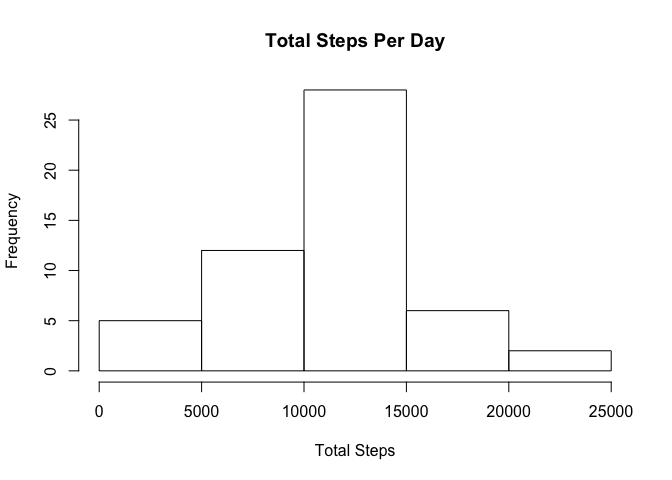
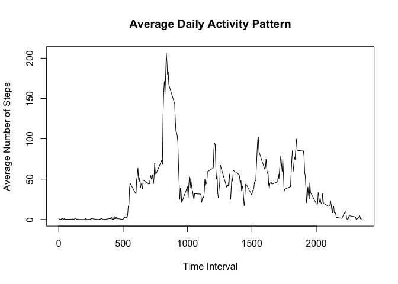
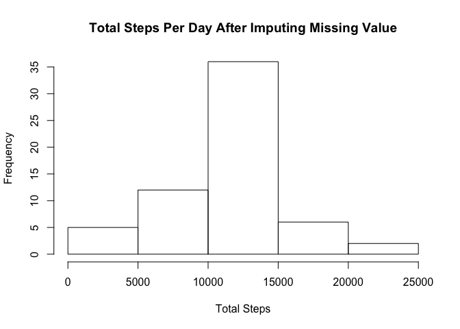
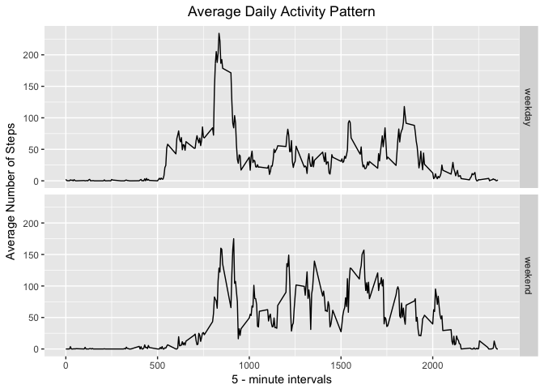

Conner Jin

## Introduction
It is now possible to collect a large amount of data about personal movement using activity monitoring devices such as a Fitbit, Nike Fuelband, or Jawbone Up. These type of devices are part of the "quantified self" movement - a group of enthusiasts who take measurements about themselves regularly to improve their health, to find patterns in their behavior, or because they are tech geeks. But these data remain under-utilized both because the raw data are hard to obtain and there is a lack of statistical methods and software for processing and interpreting the data.

  This assignment makes use of data from a personal activity monitoring device. This device collects data at 5 minute intervals through out the day. The data consists of two months of data from an anonymous individual collected during the months of October and November, 2012 and include the number of steps taken in 5 minute intervals each day.


  The data for this assignment can be downloaded from the course web site:
https://d396qusza40orc.cloudfront.net/repdata%2Fdata%2Factivity.zip


  The variables included in this dataset are:

* **steps**: Number of steps taking in a 5-minute interval (missing values are coded as NA)
* **date**: The date on which the measurement was taken in YYYY-MM-DD format
* **interval**: Identifier for the 5-minute interval in which measurement was taken
The dataset is stored in a comma-separated-value (CSV) file and there are a total of 17,568 observations in this dataset.

## Loading and preprocessing the data


```r
if (!file.exists('activity.csv')) {
  unzip(zipfile = "activity.zip")
}

data <- read.csv(file="activity.csv", header=TRUE)
```


## What is mean total number of steps taken per day?


```r
# Calculate the total steps taken per day
totalsteps <- with(data,tapply(steps,date,sum))

# Make a histogram of the total number of steps taken per day
hist(totalsteps,main="Total Steps Per Day",xlab="Total Steps",ylab="Frequency")
```

<!-- -->


```r
#Calculate and report the mean and median of the total number of steps taken per day
stepsmean <- mean(totalsteps,na.rm=TRUE)
stepsmedian <- median(totalsteps,na.rm=TRUE)
```

As you can see, the mean of total number of steps taken per day is **1.0766189\times 10^{4}** and the median of total number of steps taken per day is **10765**.

## What is the average daily activity pattern?


```r
# Make a time-series plot of the 5-minute interval and the average number of
# steps taken, averaged acoss all days.
intervalmean <- aggregate(steps ~ interval, data, mean)
plot(intervalmean,type="l",main="Average Daily Activity Pattern",xlab = "Time Interval",ylab = "Average Number of Steps")
```

<!-- -->


```r
# Which 5-minute interval, on average across all the days in the dataset, contains the maximum number of steps?
maxintervalmean <- max(intervalmean$steps)
indexmax <- intervalmean[intervalmean$steps == maxintervalmean,1]
```

The 5-minute interval 835, on average across all the days in the dataset, contains the maximum number of steps.

## Imputing missing values

Note that there are a number of days/intervals where there are missing values (coded as NA). The presence of missing days may introduce bias into some calculations or summaries of the data.


```r
# Calculate and report the total number of missing values in the dataset

missing <- sum(is.na(data$steps))
```

There are 2304 missing values in our dataset. Those missing values is replaced by the mean of the steps for that interval by the following code:


```r
# Create a new dataset that is equal to the original dataset but with the missing data filled in.
step <- transform(data,steps = ifelse(is.na(data$steps),intervalmean$steps[match(data$interval,intervalmean$interval)],data$steps))

# Make a histogram of the total number of steps taken each day and Calculate and report the mean and median total number of steps taken per day. Do these values differ from the estimates from the first part of the assignment? What is the impact of imputing missing data on the estimates of the total daily number of steps?

totalsteps2 <- with(step,tapply(steps,date,sum))
hist(totalsteps2,main="Total Steps Per Day After Imputing Missing Value",xlab="Total Steps",ylab="Frequency")
```

<!-- -->

```r
stepsmean2 <- mean(totalsteps2,na.rm=TRUE)
stepsmedian2 <- median(totalsteps2,na.rm=TRUE)
diffmean <- stepsmean - stepsmean2
diffmedian <- stepsmedian - stepsmedian2
```

After imputting, the difference in the mean of total number of steps taken per day is **0** and the difference in the median of total number of steps taken per day is **-1.1886792**.

## Are there differences in activity patterns between weekdays and weekends?


```r
# Create a new factor variable in the dataset with two levels ??? ???weekday??? and ???weekend??? indicating whether a given date is a weekday or weekend day.

weekday <- ifelse(weekdays(as.POSIXct(data$date)) %in% c("Monday","Tuesday","Wednesday","Thursday","Friday"), "weekday","weekend")
weekday <- as.factor(weekday)

newdata <- cbind(data,weekday)


# Make a panel plot containing a time series plot of the 5-minute interval (x-axis) and the average number of steps taken, averaged across all weekday days or weekend days (y-axis).

newdatamean <- aggregate(steps ~ interval + weekday, newdata , mean , na.rm = TRUE)

library(ggplot2)
ggplot(newdatamean, aes(x = interval, y = steps)) + geom_line() + facet_grid( weekday ~ .) + ggtitle("Average Daily Activity Pattern") + xlab("5 - minute intervals")+ylab("Average Number of Steps")+ theme(plot.title = element_text(hjust = 0.5))
```

<!-- -->

